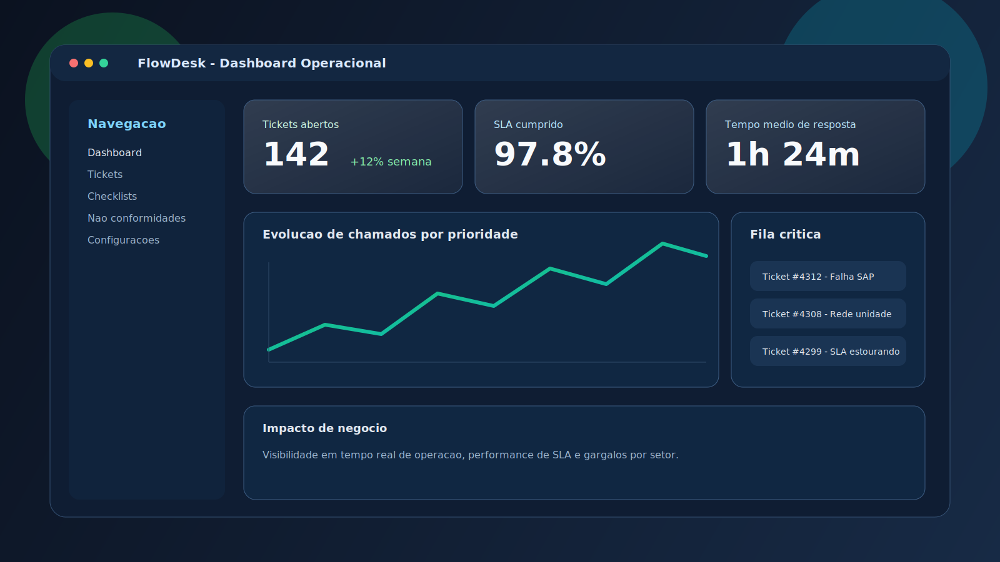
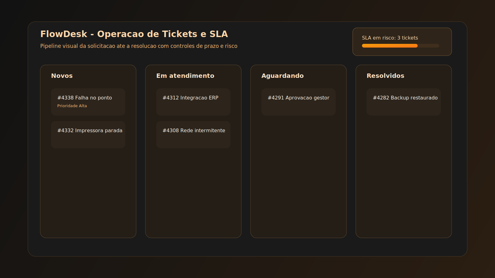

# FlowDesk

Plataforma web para **gestão de chamados internos**, **checklists operacionais**, **não conformidades** e **acompanhamento de SLA**.

> Este repositório contém a aplicação em `./flowdesk` (Next.js + TypeScript + Prisma).

## ✨ O que o sistema entrega

- **Chamados (tickets)** com prioridade, status, comentários, anexos e timeline.
- **SLA automático** por prioridade com acompanhamento de prazo.
- **Checklists operacionais** com execução e histórico.
- **Não conformidades** com fluxo de tratamento.
- **Dashboard** com KPIs e gráficos.
- **Gestão de usuários e perfis (RBAC)**.
- **Configurações** de empresa, setores, unidades e regras de SLA.

## 🖼️ Screenshots para apresentação

### Dashboard executivo



### Operação de tickets e SLA



## 🧱 Stack técnica

- **Frontend/Backend**: Next.js 16 (App Router)
- **Linguagem**: TypeScript
- **UI runtime**: React 19
- **Banco**: PostgreSQL
- **ORM**: Prisma
- **Autenticação**: NextAuth
- **Validação**: Zod
- **UI**: Tailwind CSS + Radix UI
- **Testes**: Vitest

## 📁 Estrutura principal

```txt
.
├── flowdesk/
│   ├── src/
│   │   ├── app/                 # Rotas (App Router) + API routes
│   │   ├── components/          # Componentes UI e módulos de negócio
│   │   ├── lib/                 # Auth, Prisma, SLA, permissões, validações
│   │   └── server/              # Services e repositories
│   ├── prisma/                  # schema.prisma e seed
│   ├── package.json
│   ├── ARCHITECTURE.md
│   └── FOLDER_STRUCTURE.md
└── README.md
```

## 🚀 Como rodar localmente

### 1) Pré-requisitos

- Node.js 18.17+ ou 20+
- PostgreSQL 14+
- npm

### 2) Instalação

```bash
cd flowdesk
npm install
```

### 3) Configurar variáveis de ambiente

Copie o arquivo de exemplo e preencha os valores:

```bash
cp flowdesk/.env.example flowdesk/.env.local
```

As variáveis necessárias são:

| Variável | Descrição |
|---|---|
| `DATABASE_URL` | String de conexão com o PostgreSQL |
| `NEXTAUTH_URL` | URL base da aplicação (ex.: `http://localhost:3000`) |
| `NEXTAUTH_SECRET` | Secret do NextAuth — gere com `openssl rand -base64 32` |
| `UPLOADTHING_SECRET` | Chave secreta do [Uploadthing](https://uploadthing.com) (upload de anexos) |
| `UPLOADTHING_APP_ID` | ID do app no Uploadthing |

> Variáveis opcionais (ex.: `RESEND_API_KEY` para notificações por e-mail) estão documentadas no próprio `flowdesk/.env.example`.

### 4) Banco de dados

```bash
cd flowdesk
npm run db:generate
npm run db:migrate
npm run db:seed
```

### 5) Subir aplicação

```bash
cd flowdesk
npm run dev
```

Acesse: `http://localhost:3000`

## 🛠️ Scripts úteis

Executar em `flowdesk/`:

```bash
npm run dev            # desenvolvimento
npm run build          # build de produção
npm run start          # start produção
npm run lint           # lint
npm run test           # testes unitários
npm run test:ci        # testes + cobertura

npm run db:generate
npm run db:migrate
npm run db:migrate:prod
npm run db:push
npm run db:seed
npm run db:studio
npm run db:reset
```

## 🧭 Documentação adicional

- `flowdesk/README.md` → documentação funcional mais detalhada.
- `flowdesk/ARCHITECTURE.md` → visão de arquitetura.
- `flowdesk/FOLDER_STRUCTURE.md` → organização de pastas.

## 📌 Observações

- O projeto está estruturado para evoluir em cenários multiempresa (multi-tenant).
- O controle de acesso é baseado em papéis (ex.: ADMIN, MANAGER, ANALYST, REQUESTER).

## 📄 Licença

Consulte o arquivo `LICENSE` na raiz do repositório.
